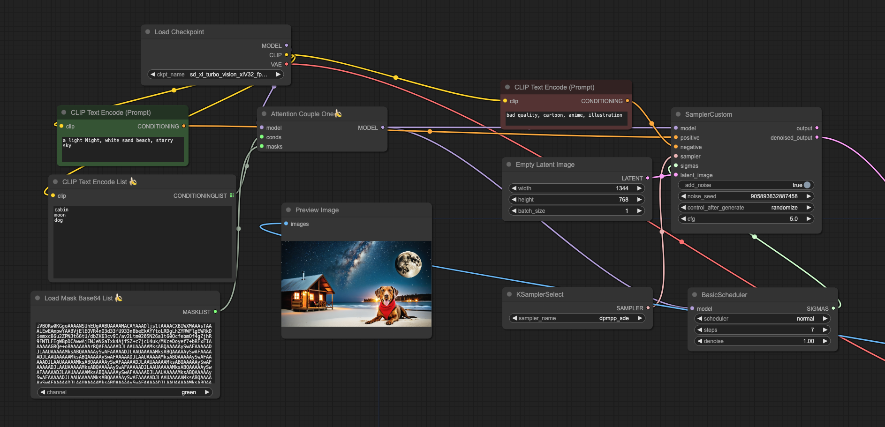

项目 fork 自 [cgem156-ComfyUI](https://github.com/laksjdjf/cgem156-ComfyUI.git)，主要使用分区生图功能（Regional Prompter）

## 修改内容
- 新增 CLIP Text Encode List 节点（基于多个蒙版的批量提示词，换行符 \n 分割）
- 新增 Load Mask Base64 List 节点（批量蒙版，内容为蒙版图片的 base64 数据，使用换行符 \n 分割），通道使用 RGB 任意一种
- 修改 Attention couple，使其支持固定参数，动态参数内容

## 使用
安装本节点后，使用 workflow 文件夹的工作流
## TODO
- 基于分区蒙版自动拆分主分区蒙版